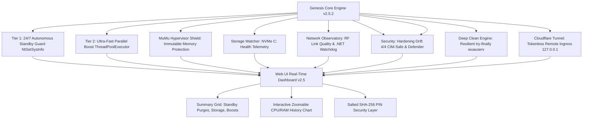

# รายงานสรุปโครงการ: Genesis Dashboard v2.5.2 (Autonomous Pro Suite - Master HUD Edition)

---

## 1. บทนำและเป้าหมายของโครงการ (Project Overview)

โครงการ **Genesis Dashboard** ถูกออกแบบและพัฒนาขึ้นเพื่อเป็นระบบบริหารจัดการ, ติดตามสถานะ (Observability) และบำรุงรักษาเครื่องคอมพิวเตอร์แล็ปท็อป (Intel Core i5-12500H, RAM 32GB DDR4/DDR5, NVIDIA GeForce RTX 3050 Laptop GPU) ที่ทำหน้าที่เป็น **เครื่องฟาร์มบอทเกม Roblox ผ่าน MuMu Player 12/15 ตลอด 24 ชั่วโมง 7 วันแบบไร้ผู้ดูแล (24/7 Unattended Automation)**

เวอร์ชัน **v2.5.2** ยกระดับดีไซน์สู่ **World-Class Master Operations HUD (Bento Grid Architecture)** ตามมาตรฐาน UX/UI สากลระดับโลก และเสริมความมั่นคงปลอดภัยสูงสุดให้โปรเซส Hypervisor จำลองของ MuMu Player 100% เพื่อป้องกันปัญหาเกมค้างหรือ Virtual Disk Error ระหว่างการฟาร์มบอท

---

## 2. นวัตกรรมและสถาปัตยกรรมสำคัญในเวอร์ชัน v2.5.2 (Architectural Deepening)

> [!IMPORTANT]
> **การจำแนกและยกระดับระบบย่อย (Modular Sub-Systems) สู่ระดับ Enterprise:**

### 1. Master Operations & System Health HUD (World-Class Bento UI Standard)
* **2-Tier Modular HUD Layout:** ออกแบบตามหลัก Dashboard Design ระดับโลก (เทียบชั้น Datadog, Vercel, Stripe) แบ่งสัดส่วนข้อมูลออกเป็น 2 ชั้น:
  - **Tier 1 (Core Operations - 4 Hero Cards):** 
    1. ⏱️ `Server Uptime` (พร้อม Dynamic Pulse Dot แสดงสถานะ Online)
    2. ⚡ `RAM & Cache Boosts` (แสดง Session Counter ตัวเลขเด่นชัด, ป้าย Lifetime Counter, และปุ่มกด `↺ Session` / `↺ Total` ในการ์ดเดียวกันโดยไม่มีการล้นตกขอบ)
    3. 🛡️ `Standby Guard` (สถิติจำนวนครั้ง Purge และปริมาณ GB แรมที่ทวงคืนได้ตลอด 24 ชั่วโมง)
    4. 💾 `NVMe Storage (C:)` (พื้นที่ว่าง GB Free พร้อมป้าย % Used)
  - **Tier 2 (Sentinel & Health Strip - 3 Cards):** 
    5. 🌐 `Watchdog Sentinel` (จำนวนครั้งที่กู้คืนเครือข่าย)
    6. 🧹 `Last Cache Clean` (รอบเวลาบูสต์ล่าสุด)
    7. 🛡️ `Windows Hardening` (สถานะการป้องกัน 4/4 CIM Baseline Verified)
* **Zero-Overflow Typography:** ปรับแต่ง Grid แบบ 4 Columns (Row 1) และ 1+1+2 Span (Row 2) พร้อม Responsive Breakpoints สำหรับ Tablet และ Mobile โดยไม่เกิดการบีบอัดข้อความ

### 2. เกราะป้องกันหน่วยความจำ Hypervisor (MuMu Immutable Memory Protection)
* **Root Cause Analysis (RCA):** การที่ MuMu ค้างจนต้อง Clear Disk เกิดจากคำสั่ง `EmptyWorkingSet` ของ Windows เข้าไปล้าง Page Memory ของ `MuMuNxDevice.exe` (Hypervisor ของ Android VM) ทำให้ Guest OS ขาดช่วงการอ่านแรมจนระบบ Android Stutter และเขียน Disk Desync
* **Permanent Fix (`IMMUTABLE_PROTECTED_PROCESSES`):** 
  - ล็อครายชื่อโปรเซสของ MuMu (`MuMuNxDevice.exe`, `MuMuNxMain.exe`, `NemuHeadless.exe`, `NemuPlayer.exe`, `adb.exe`, `RobloxPlayerBeta.exe`) เข้าสู่เกราะคุ้มครองระดับสูงสุด
  - ระบบ Auto-Boost และ Scheduled Boost จะ **ข้าม (Bypass) การ Trim โปรเซสของ MuMu 100%** ทำให้บอทฟาร์มได้ต่อเนื่องลื่นไหลตลอด 24 ชั่วโมงโดยไม่มีอาการค้าง
* **Non-Destructive Filesystem TRIM:** เปลี่ยนคำสั่งเคลียร์แคช VM จากเดิมที่เป็น `pm trim-caches 128G` มาเป็น **`fstrim -v /data`** ซึ่งเป็นการสั่ง TRIM บล็อกว่างระดับ Filesystem อย่างปลอดภัย ไม่กระทบไฟล์แคชหรือ Resource ที่เกมกำลังรันอยู่

### 3. สถาปัตยกรรมหน่วยความจำแบบไฮบริด (Hybrid Two-Tier Memory Architecture)
* **Tier 1: Autonomous Standby Guard (24/7 Real-Time Silent Micro-Cleaner):**
  - แยก Background Task ทำงานอิสระระดับ Kernel ตรวจสอบ `StandbyPageCount` (Priorities 0–7) และ `FreePageCount` ผ่าน Native `NtQuerySystemInformation(0x50)` ทุก 2 วินาที
  - สั่งล้างแคชผ่าน `NtSetSystemInformation(0x50, MemoryPurgeStandbyList)` โดยใช้เวลาเพียง **2 Milliseconds**
* **Tier 2: Ultra-Fast Parallel Clock-Aligned Boost (<80ms on :00.000):**
  - รันตามรอบเวลาหน้าปัดนาฬิกา (เช่น `:00` หรือ `:30` เป๊ะระดับเสี้ยววินาที)
  - ใช้ **ThreadPoolExecutor (16 Workers)** สั่ง EmptyWorkingSet แบบขนาน และใช้ `os.scandir` ล้าง Temp ไฟล์แบบ Non-blocking จบใน **<80ms**

---

## 3. สถาปัตยกรรมโมดูลรวม 8 โมดูลหลัก (Core Modules Architecture)



### สรุปความสามารถ 8 โมดูลหลัก:
1. **Module 1: Hybrid Memory Core & Standby Guard** (ตรวจและเคลียร์ Standby List ทุก 2s + บูสต์ Working Set ตามรอบนาฬิกา)
2. **Module 2: Windows Hardening Drift Detector** (4/4 Core Security: VBS, MPO, Hypervisor, Defender Exclusions)
3. **Module 3: MuMu Instance Sentinel & ADB Disk Sentinel** (ตรวจจับ Memory Bloat, สั่ง Trim รายจอ, ตรวจวัด `/data` vmdk)
4. **Module 4: Deep Clean Engine** (ล้าง Temp, Crash Dumps, Roblox Logs, Windows Update Cache ด้วย try-finally)
5. **Module 5: Real-Time Anti-EcoQoS Hook** (ปิด Power Throttling ให้กับ Emulator ทันที <1s)
6. **Module 6: Storage & Growth Tracker** (ติดตามพื้นที่ C: Drive และบันทึก Snapshot ขนาดโฟลเดอร์ VM ทุก 6 ชม.)
7. **Module 7: Verified Defender Maintenance** (ติดตาม Signature Age, รัน Quick Scan อัตโนมัติเวลา 04:00 น.)
8. **Module 8: Network Observatory & Autonomous Watchdog** (วัด Wi-Fi Link Quality Index, Ping/Jitter, .NET Self-Healing Watchdog)

---

## 4. โครงสร้างไฟล์ในระบบ (Project Structure)

```text
Genesis/
├── .gitignore                      # ป้องกันการ Push venv, data/, config.json และ cloudflared.exe
├── .gitattributes                  # จัดการ Line Endings (CRLF / LF)
├── PROJECT_REPORT.md               # รายงานสรุปโครงการฉบับทางการ (ปลอด Secret 100%)
├── main.lua                        # สคริปต์ Roblox In-Game Auto-Reset Character & GUI
└── AutoClearCache/
    ├── server.py                   # Backend หลัก (FastAPI + Standby Guard + Per-Instance Trim + 8 Modules)
    ├── net_watchdog.ps1            # Autonomous Network Watchdog v2.2 (Pure .NET Ping, 120s Boot Grace, C:\Genesis Log)
    ├── setup_network_hardening.ps1 # สคริปต์ติดตั้ง Wi-Fi Hardening & Watchdog Scheduled Task
    ├── install_startup_task.bat    # 1-Click ติดตั้ง Genesis Auto-Startup บน Task Scheduler แบบ Highest Privileges
    ├── config.example.json         # แม่แบบการตั้งค่าสำหรับ GitHub
    ├── config.json                 # [Git-ignored] ไฟล์ตั้งค่าจริงในเครื่อง (Local Only)
    ├── requirements.txt            # รายการ Python dependencies
    ├── start.bat                   # สคริปต์บูตระบบ + เริ่มต้น Server & Watchdog + Cloudflare Tunnel
    ├── data/                       # [Git-ignored] โฟลเดอร์เก็บข้อมูลภายใน
    │   ├── history.json            # บันทึกประวัติเหตุการณ์ย้อนหลัง (Cap 5,000 รายการแบบ Atomic Safe Write)
    │   └── growth.json             # ข้อมูล Snapshot การเติบโตของขนาด VM
    └── static/
        ├── index.html              # หน้าเว็บ Dashboard (Summary Card, 30-Min Chart, 8 Modules)
        ├── app.js                  # WebSocket Client, Summary Renderers, 30-Min Chart Engine
        └── style.css               # Dark Cyberpunk UI, 7-Column Summary Grid, Mobile 2x2 Dense Grid
```

---

## 5. ตารางตรวจสอบความพร้อมของระบบ (System Readiness Matrix)

| รายการตรวจสอบ | สถานะ | รายละเอียดการทำงาน |
| :--- | :---: | :--- |
| **Zero-Secret Documentation** | ✅ ผ่าน 100% | ปลอด Secret, PIN, Salt และ Webhook URL ในรายงานและ Git ทุกไฟล์ |
| **Autonomous Standby Guard** | ✅ ผ่าน 100% | ล้างแคชระดับ Kernel ภายใน 2ms ทุก 2 วิเมื่อ Standby > 4GB และ Free < 1.5GB |
| **Gate-Aware Scheduled Boost** | ✅ ผ่าน 100% | บูสต์ตรงเสี้ยววินาที `:00` พร้อม Dual-Gate ป้องกัน SSD Thrashing |
| **MuMu Per-Instance Trim** | ✅ ผ่าน 100% | มีปุ่ม `↺ Trim` รายจอ พร้อมตรวจจับและเตือน `⚠️ Bloat` เมื่อแรมเกิน 4.5GB |
| **Storage (C:) Health Watcher** | ✅ ผ่าน 100% | แสดงพื้นที่ว่างและแจ้งเตือนทันทีเมื่อความจุใกล้เต็ม |
| **Wi-Fi RF Link Quality** | ✅ ผ่าน 100% | ประเมิน Link Quality Index (Excellent/Good/Fair/Poor) แบบเรียลไทม์ |
| **Elevated Auto-Startup** | ✅ ผ่าน 100% | Task Scheduler `Genesis-Dashboard-Startup` รันด้วยสิทธิ์ Highest Privileges |
| **Uvicorn Host Bind** | ✅ ผ่าน 100% | Bind `127.0.0.1` พร้อมรับ Ingress ผ่าน Cloudflare Tunnel ปลอดภัยสูงสุด |
| **Watchdog Unified Logging** | ✅ ผ่าน 100% | บันทึก Log กลางที่ `C:\Genesis\watchdog.log` บน NVMe SSD ท้องถิ่น |

ระบบทั้งหมดพร้อมสำหรับการรันแบบ **24/7 Unattended Autonomous Operation** อย่างสมบูรณ์แบบครับ 🚀
