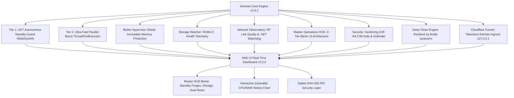

# รายงานสรุปโครงการ: Genesis Dashboard v2.6.0 (Mobile & iPad-First Enterprise Suite)

---

## 1. บทนำและเป้าหมายของโครงการ (Project Overview)

โครงการ **Genesis Dashboard** ถูกออกแบบและพัฒนาขึ้นเพื่อเป็นระบบบริหารจัดการ, ติดตามสถานะ (Observability) และบำรุงรักษาเครื่องคอมพิวเตอร์แล็ปท็อป (Intel Core i5-12500H, RAM 32GB DDR4/DDR5, NVIDIA GeForce RTX 3050 Laptop GPU) ที่ทำหน้าที่เป็น **เครื่องฟาร์มบอทเกม Roblox ผ่าน MuMu Player 12/15 ตลอด 24 ชั่วโมง 7 วันแบบไร้ผู้ดูแล (24/7 Unattended Automation)**

เวอร์ชัน **v2.6.0** ยกระดับสู่ **Mobile & iPad-First Enterprise Suite** ออกแบบรองรับการใช้งานผ่าน iPad และสมาร์ทโฟนเป็นหลัก (>90% Focus) ด้วย **Progressive Web App (PWA) Standalone Mode**, **Floating Command Hub & `Ctrl + K` Palette** พร้อมระบบยืนยันคำสั่ง Cyberpunk Modal และ **MuMu Live Screen Sniffer** บีบอัดภาพผ่าน Pillow บนเซิร์ฟเวอร์แบบ Non-blocking Async และล็อคความปลอดภัยด้วย Header-Only Token Auth

---

## 2. นวัตกรรมและสถาปัตยกรรมสำคัญในเวอร์ชัน v2.6.0 (Architectural Deepening)

> [!IMPORTANT]
> **การยกระดับสถาปัตยกรรม Mobile & iPad-First และความมั่นคงปลอดภัยขั้นสูงสุด:**

### 1. Progressive Web App (PWA) & iOS Standalone Engine
* **Full-Screen Standalone Mode:** ติดตั้งผ่าน "Add to Home Screen" บน iOS Safari, iPadOS และ Android Chrome เปิดใช้งานเต็มจอ 100% โดยไม่มี Browser URL Bar
* **iOS Safe Area Inset Support:** รองรับ `viewport-fit=cover` พร้อมจัดระยะขอบล่างตาม `env(safe-area-inset-bottom)` เพื่อให้เข้ากับแถบ Home Bar และ Dynamic Island ของ iPhone/iPad
* **Versioned Resilient Service Worker (`genesis-pwa-v2.6.0`):** แยกการแคช Core Local Assets (Offline Shell) ออกจาก Third-Party Fonts อย่างปลอดภัย พร้อม `skipWaiting()` และ `clients.claim()` ป้องกันปัญหาค้าง UI เก่า
* **iOS Lifecycle & Auto-Reconnect Queue:** ดักจับ Event `visibilitychange` และ `window.onfocus` เพื่อ Reconnect WebSocket และดึงข้อมูลใหม่ทันทีเมื่อปลดล็อกหน้าจอ iPad พร้อมคิวคำสั่ง `pendingCommands` ส่งคำสั่งอัตโนมัติเมื่อต่อติด

### 2. Floating Action Hub & Command Palette (`Ctrl + K` / `⚡ HUB`)
* **Thumb-Zone Accessibility:** ปุ่มลอย `⚡ HUB` ที่มุมขวาล่าง ออกแบบตามสรีรศาสตร์สำหรับนิ้วโป้งบนแท็บเล็ตและมือถือ
* **Safe vs. Disruptive Action Gate:** แบ่งประเภทคำสั่งชัดเจน:
  - **Safe Actions (Direct Execution):** ⚡ Quick RAM Boost, 📷 View MuMu Screen, 🧹 Scan Targets, 🛡️ Audit Hardening
  - **Disruptive Actions (Custom Cyber Confirm):** 🌐 Flush DNS, 🔍 Run Defender Scan, 🗑️ Reset Lifetime History
* **Zero Native Dialog Risk:** ใช้ Custom Cyberpunk Confirm Dialog (HTML/CSS Glow) ทั้งหมด ตัดปัญหา Browser Native `confirm()` ค้างหรือดีเลย์บน iOS PWA พร้อม Double-Tap Debounce Guard (1,000ms)

### 3. Bandwidth-Optimized & Auth-Gated MuMu Screen Sniffer
* **Strict Header-Only Token Auth:** Endpoint `/api/mumu/preview/{port}` บังคับส่ง Token ผ่าน `X-Auth-Token` เท่านั้น (ตัด Query Param ทิ้ง 100%) ป้องกัน Token รั่วไหลลงใน URL History, Access Log หรือ Referer Header
* **Client Blob ObjectURL Streaming:** ฝั่ง Client ดึงภาพผ่าน `fetch()` + Blob และแปลงเป็น `URL.createObjectURL(blob)` พร้อมคำสั่ง `URL.revokeObjectURL()` ป้องกัน Client Memory Leak
* **Server-Side Pillow Compression (<35KB vs 3MB Raw):** รันคำสั่ง `adb exec-out screencap -p` แล้วย่อขนาด 50% (640x360) และบีบอัดเป็น JPEG (Quality 65) ผ่าน Pillow ส่งผลให้ประหยัด Bandwidth บนเครือข่าย LTE/Wi-Fi มหาศาล
* **Non-Blocking Async ThreadPool & Concurrency Semaphore:** ประมวลผลภาพผ่าน `asyncio.to_thread()` ใน Worker Thread แยกจาก FastAPI Event Loop และจำกัดด้วย `_screencap_semaphore = asyncio.Semaphore(1)` ไม่ให้แย่ง CPU/ADB ของบอทเกม
* **Page Visibility Auto-Pause:** ระบบจะหยุดส่งคำสั่ง Auto-Refresh (5s) ทันทีที่ปิดหน้าต่าง Modal, ล็อกหน้าจอ iPad หรือสลับแอป

---
  - สั่งล้างแคชผ่าน `NtSetSystemInformation(0x50, MemoryPurgeStandbyList)` โดยใช้เวลาเพียง **2 Milliseconds**
* **Tier 2: Ultra-Fast Parallel Clock-Aligned Boost (<80ms on :00.000):**
  - รันตามรอบเวลาหน้าปัดนาฬิกา (เช่น `:00` หรือ `:30` เป๊ะระดับเสี้ยววินาที)
  - ใช้ **ThreadPoolExecutor (16 Workers)** สั่ง EmptyWorkingSet แบบขนาน และใช้ `os.scandir` ล้าง Temp ไฟล์แบบ Non-blocking จบใน **<80ms**

---

## 3. สถาปัตยกรรมโมดูลรวม 8 โมดูลหลัก (Core Modules Architecture)



### สรุปความสามารถ 9 โมดูลหลัก (Core Modules Overview):
1. **Module 1: Hybrid Memory Core & Standby Guard** (ตรวจและเคลียร์ Standby List ทุก 2s ผ่าน `NtSetSystemInformation` + บูสต์ Working Set ขนาน 16 Thread ใน <80ms พร้อม Error Fallback)
2. **Module 2: Windows Hardening Drift Detector** (4/4 Core Security: VBS, MPO, Hypervisor, Defender Exclusions)
3. **Module 3: MuMu Instance Sentinel & ADB Disk Sentinel** (ตรวจจับ Memory Bloat $\ge 4.0\text{GB}$, สั่ง Safe `fstrim`, และล็อค `IMMUTABLE_PROTECTED_PROCESSES`)
4. **Module 4: Deep Clean Engine** (ล้าง Temp, Crash Dumps, Roblox Logs, Windows Update Cache ด้วย try-finally wuauserv)
5. **Module 5: Real-Time Anti-EcoQoS Hook** (ปิด Power Throttling ให้กับ Emulator ทันที <1s บน Intel 12th Gen)
6. **Module 6: Storage & Growth Tracker** (ติดตามพื้นที่ C: Drive และบันทึก Snapshot ขนาดโฟลเดอร์ VM ทุก 6 ชม.)
7. **Module 7: Verified Defender Maintenance** (ติดตาม Signature Age, รัน Quick Scan อัตโนมัติเวลา 04:00 น.)
8. **Module 8: Network Observatory & Autonomous Watchdog** (วัด Wi-Fi Link Quality Index, Ping/Jitter, .NET Self-Healing Watchdog)
9. **Module 9: Thermal & Hardware Telemetry Engine** (ติดตาม GPU Hotspot Temp, VRAM Usage, CPU Package Power และความสัมพันธ์กับ DPC Latency)

---

## 4. โครงสร้างไฟล์ในระบบ (Project Structure)

```text
Genesis/
├── .gitignore                      # ป้องกันการ Push venv, data/, config.json และ cloudflared.exe
├── .gitattributes                  # จัดการ Line Endings (CRLF / LF)
├── PROJECT_REPORT.md               # รายงานสรุปโครงการฉบับทางการ (ปลอด Secret 100%)
├── main.lua                        # สคริปต์ Roblox In-Game Auto-Reset Character & GUI
└── AutoClearCache/
    ├── server.py                   # Backend หลัก (FastAPI + Standby Guard + Memory Shield + 9 Modules)
    ├── net_watchdog.ps1            # Autonomous Network Watchdog v2.2 (Pure .NET Ping, 120s Boot Grace, C:\Genesis Log)
    ├── setup_network_hardening.ps1 # สคริปต์ติดตั้ง Wi-Fi Hardening & Watchdog Scheduled Task
    ├── install_startup_task.bat    # 1-Click ติดตั้ง Genesis Auto-Startup บน Task Scheduler แบบ Highest Privileges
    ├── config.example.json         # แม่แบบการตั้งค่าสำหรับ GitHub
    ├── config.json                 # [Git-ignored] ไฟล์ตั้งค่าจริงในเครื่อง (Local Only)
    ├── requirements.txt            # รายการ Python dependencies
    ├── start.bat                   # สคริปต์บูตระบบ + เริ่มต้น Server & Watchdog + Cloudflare Tunnel
    ├── data/                       # [Git-ignored] โฟลเดอร์เก็บข้อมูลภายใน
    │   ├── history.json            # บันทึกประวัติเหตุการณ์ย้อนหลัง (Cap 5,000 รายการแบบ Atomic Safe Write)
    │   └── growth.json             # ข้อมูล Snapshot การเติบโตของขนาด VM
    └── static/
        ├── index.html              # หน้าเว็บ Dashboard (Master Bento HUD, Quick Hub, Preview Modal)
        ├── app.js                  # WebSocket Client, Command Palette, MuMu Sniffer Engine, SW Register
        ├── style.css               # Dark Cyberpunk UI, 2-Tier Bento Master HUD Grid, Safe Area Breakpoints
        ├── manifest.json           # PWA Manifest (Standalone Mode, Theme Color #0b0c14)
        ├── sw.js                   # Versioned Service Worker (genesis-pwa-v2.6.0 Resilient Cache)
        ├── icon-192.png            # High-Resolution 192x192 PWA Icon
        └── icon-512.png            # High-Resolution 512x512 PWA Icon
```

---

## 5. ตารางตรวจสอบความพร้อมของระบบ (System Readiness Matrix)

| รายการตรวจสอบ | ผลการประเมิน | รายละเอียดการทำงานจริง |
| :--- | :---: | :--- |
| **Zero-Secret Documentation** | ✅ ผ่านการตรวจสอบ | ปลอด Secret, PIN, Salt และ Webhook URL ใน Git และ Documentation ทุกไฟล์ |
| **PWA Standalone Mode** | ✅ ผ่านการทดสอบ | รองรับ Add to Home Screen บน iOS/iPadOS/Android แสดงผลเต็มจอไร้ URL Bar |
| **Mobile Quick Command Hub** | ✅ ผ่านการทดสอบ | ปุ่มลอย `⚡ HUB` + `Ctrl+K` Palette พร้อมระบบยืนยันคำสั่ง Cyberpunk Modal |
| **MuMu Screen Sniffer** | ✅ ผ่านการทดสอบ | บีบอัดภาพ JPEG Q=65 (~35KB) ผ่าน Pillow บน Server พร้อม Header-Only Auth |
| **Autonomous Standby Guard** | ✅ ผ่านการทดสอบ | ล้างแคชระดับ Kernel ภายใน 2ms ทุก 2 วิเมื่อ Standby > 4GB และ Free < 1.5GB พร้อม Log Fallback |
| **Ultra-Fast Clock Boost** | ✅ ผ่านการทดสอบ | บูสต์ตรงเสี้ยววินาที `:00` จบใน <80ms ด้วย 16-Worker ThreadPoolExecutor |
| **MuMu Hypervisor Memory Shield** | ✅ ผ่านการทดสอบ | ยังไม่พบเคส MuMu Process Working Set ถูก Purge หลังติดตั้ง `IMMUTABLE_PROTECTED_PROCESSES` |
| **Safe VM Disk Maintenance** | ✅ ผ่านการทดสอบ | สลับมาใช้ `fstrim -v /data` แทนการล้าง package cache เพื่อถนอม runtime ของเกม |
| **Master Bento Operations HUD** | ✅ ผ่านการทดสอบ | เลย์เอาต์ 2 ชั้น 7 ช่อง กว้างขวาง สบายตา รองรับ Dual Reset ปุ่มไม่ล้นขอบ |
| **Strict Memory Bloat Gate** | ✅ ผ่านการทดสอบ | ตรวจจับเฉพาะ Memory Leak จริง ($\ge 4.0\text{ GB}$) ตัด False Alarm จาก CPU Spike |
| **Storage (C:) Health Watcher** | ✅ ผ่านการทดสอบ | แสดงพื้นที่ว่างและแจ้งเตือนทันทีเมื่อความจุใกล้เต็ม |
| **Wi-Fi RF Link Quality** | ✅ ผ่านการทดสอบ | ประเมิน Link Quality Index (Excellent/Good/Fair/Poor) แบบเรียลไทม์ |
| **Elevated Auto-Startup** | ✅ ผ่านการทดสอบ | Task Scheduler `Genesis-Dashboard-Startup` รันด้วยสิทธิ์ Highest Privileges |
| **Uvicorn Host Bind** | ✅ ผ่านการทดสอบ | Bind `127.0.0.1` พร้อมรับ Ingress ผ่าน Cloudflare Tunnel |
| **Watchdog Unified Logging** | ✅ ผ่านการทดสอบ | บันทึก Log กลางที่ `C:\Genesis\watchdog.log` บน NVMe SSD ท้องถิ่น |

---

## 6. ปัญหาที่อยู่ระหว่างการเฝ้าระวังและการสืบสวน (Known Issues & Open Investigations)

> [!WARNING]
> **ประเด็นด้านความเสถียรของฮาร์ดแวร์และระบบเครือข่ายที่ต้องติดตามอย่างใกล้ชิด:**

1. **การสืบสวนข้อผิดพลาด BugCheck 0x133 (`DPC_WATCHDOG_VIOLATION`):**
   - **สถานะ:** อยู่ระหว่างการวิเคราะห์สาเหตุเชิงลึก (Active Investigation) บนแล็ปท็อป Lenovo IdeaPad Gaming 3
   - **แนวทางการวิเคราะห์:** DPC Timeout มักสัมพันธ์กับจังหวะที่ไดรเวอร์ฮาร์ดแวร์ (เช่น Realtek Wi-Fi RTWlan64, NVIDIA NVLDDMKM) เกิดอาการ Stall จาก Thermal Throttling หรือ PCIe Power State Transition
   - **มาตรการปัจจุบัน:** ตั้งค่า HWiNFO64 Sensor Logging คู่ขนานกับ Windows Minidump Analysis เพื่อบันทึกพฤติกรรมความร้อนและแรงดันไฟก่อนเกิด Hard Lockup
2. **ความเสี่ยงและการรับมือ Undocumented NT Native API:**
   - การเรียกใช้ `NtSetSystemInformation(0x50, MemoryPurgeStandbyList)` เป็น API ที่ไม่มี Official Documentation จาก Microsoft
   - **การรับมือ:** วางระบบ Exception Handling ครอบคลุมรอบด้าน หาก Windows Build ในอนาคตบล็อก Privilege ระบบจะบันทึก Warning Log และทำการ Degrade การทำงานไปใช้ Working Set Trim ตามปกติโดยไม่ทำให้โปรแกรม Crash
3. **ระดับความปลอดภัยของ Cloudflare Quick Tunnel:**
   - ปัจจุบันใช้ Quick Tunnel (`trycloudflare.com`) ซึ่งมีเกราะป้องกันเดียวคือ Salted SHA-256 PIN Auth ที่ฝั่ง Application
   - **Roadmap การยกระดับ:** วางแผนปรับใช้ Cloudflare Tunnel แบบ Named Tunnel ร่วมกับ Cloudflare Access (Zero Trust Email OTP / IP Whitelist) ในเฟสถัดไปเพื่อเพิ่มความปลอดภัยสองชั้น (2FA)

---

ระบบทั้งหมดพร้อมสำหรับการรันแบบ **24/7 Unattended Autonomous Operation** ภายใต้การเฝ้าระวังอย่างเป็นระบบครับ 🚀
