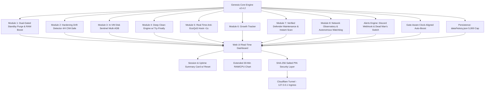

# รายงานสรุปโครงการ: Genesis Dashboard v2.4.2 (Fable 5 Production Suite - Burn-In Ready)

---

## 1. บทนำและเป้าหมายของโครงการ (Project Overview)

โครงการ **Genesis Dashboard** ถูกออกแบบและพัฒนาขึ้นเพื่อเป็นระบบบริหารจัดการ, ติดตามสถานะ (Observability) และบำรุงรักษาเครื่องคอมพิวเตอร์แล็ปท็อป (Intel Core i5-12500H, RAM 32GB DDR4/DDR5, NVIDIA GeForce RTX 3050 Laptop GPU) ที่ทำหน้าที่เป็น **เครื่องฟาร์มบอทเกม Roblox ผ่าน MuMu Player 12/15 ตลอด 24 ชั่วโมง 7 วันแบบไร้ผู้ดูแล (24/7 Unattended Automation)**

เวอร์ชัน **v2.4.2** เป็นเวอร์ชันสมบูรณ์แบบสูงสุดที่ผ่านการตรวจสอบทางวิศวกรรม (Engineering Audit) และปิดช่องโหว่ความปลอดภัยทุกด้าน พร้อมเข้าสู่ช่วง **7-Day Burn-In Production Test**

---

## 2. ตอบข้อสรุป 4 ประเด็นสำคัญด้านสถาปัตยกรรม (Architecture & Resilience Audit)

> [!IMPORTANT]
> **การตรวจสอบและแก้ไขเชิงเทคนิคเพื่อความอยู่รอดแบบ 24/7 ไร้ผู้ดูแล:**

### 1. นโยบายความปลอดภัยของ Secret & Authentication (Zero-Secret Documentation Policy)
* **การแก้ไข:** ถอดรหัสผ่าน (PIN), ค่า Salt, และ Discord Webhook URL ออกจากเอกสารและ Git ทั้งหมดอย่างถาวร
* **การจัดเก็บ:** จัดเก็บค่า Hash และ Dynamic Salt เฉพาะใน `config.json` ในเครื่องของผู้ใช้เท่านั้น (ถูกระบุไว้ใน `.gitignore`)
* **กลไกความปลอดภัย:** ป้องกัน Brute-Force ผ่าน `secrets.compare_digest` เพื่อกัน Timing Attack ร่วมกับ Cloudflare Real-IP Rate Limiting (บล็อก 10 นาทีเมื่อใส่รหัสผิดเกิน 5 ครั้ง)

### 2. Clock-Aligned Auto-Boost ควบคู่ Dual-Condition Gate (ป้องกัน SSD Thrashing)
* **กลไกการทำงาน:** แม้ผู้ใช้จะตั้งเวลาเป็นโหมด Scheduled (เช่น บูสต์ทุก `:00` และ `:30` บนหน้าปัดนาฬิกา) แต่ระบบจะไม่ยิง `EmptyWorkingSet` สุ่มสี่สุ่มห้า
* **การเช็คเงื่อนไขก่อนยิง (Gate Evaluation):**
  - เมื่อถึงรอบเวลา (เช่น `10:00:00`) ระบบจะตรวจสอบสุขภาพ RAM ปัจจุบัน
  - **จะทำงานก็ต่อเมื่อ:** `RAM >= Threshold` (เช่น 80%) หรือ `Available < 4GB` หรือ `Standby > 4GB` เข้าเงื่อนไข Dual-Gate
  - **หาก RAM ยังเหลือเฟือและสุขภาพดี:** ระบบจะ **Skip (ข้าม) การบูสต์รอบนั้นทันที** พร้อมบันทึกลง Event Log: *"Scheduled Boost skipped: Memory healthy"*
* **ผลลัพธ์เชิงวิศวกรรม:** ป้องกันการเกิด Forced Page Faults และป้องกันการอ่านเขียน SSD โดยไม่จำเป็น รักษาความเสถียรของ Emulator ให้คงที่ตลอด 24 ชั่วโมง

### 3. Startup Automation ด้วย Task Scheduler (Highest Privileges - แก้ปัญหา UAC)
* **ปัญหาเดิม:** การใส่ Shortcut ใน `shell:startup` ทำให้โปรแกรมรันด้วยสิทธิ์ User ทั่วไป ซึ่งไม่สามารถเรียกใช้ Win32 `NtSetSystemInformation` (ล้าง Standby) หรือจัดการ Service ได้สมบูรณ์
* **ทางแก้มาตรฐาน:** จัดเตรียมไฟล์ติดตั้ง [`install_startup_task.bat`](file:///c:/Users/rocke/OneDrive/Documents/GitHub/Genesis/AutoClearCache/install_startup_task.bat) ที่ลงทะเบียนงานใน **Windows Task Scheduler** (`Genesis-Dashboard-Startup`)
  - Trigger: `AtLogOn`
  - สิทธิ์: `RunLevel: Highest` (รันสิทธิ์สูงสุดโดยไม่ติด UAC prompt ค้างหน้าจอ)
  - Settings: ทำงานได้แม้ใช้แบตเตอรี่ และไม่มีการ Timeout ปิดตัวเอง

### 4. Uvicorn Bind Host (`127.0.0.1`)
* **การตั้งค่า:** กำหนด `"host": "127.0.0.1"` ใน `config.json`
* **เหตุผลทางความปลอดภัย:** เนื่องจากระบบเปิดให้รีโมทเข้ามาจากภายนอกผ่าน **Cloudflare Tunnel (`cloudflared`)** ซึ่งทำหน้าที่เป็น Secure Ingress Proxy เชื่อมต่อผ่าน `http://localhost:7700` อยู่แล้ว การ bind เฉพาะ `127.0.0.1` จะปิดกั้นไม่ให้อุปกรณ์อื่นในวง LAN เดียวกัน (เช่น Wi-Fi หอพัก/มหาลัย) สามารถยิงตรงเข้าพอร์ต 7700 ได้โดยตรง

### 5. เอกภาพของ Watchdog Log Path
* ตรวจสอบความถูกต้องของพาธไฟล์ Log: ทั้งตัว **Watchdog Script (`net_watchdog.ps1`)**, **Installer (`setup_network_hardening.ps1`)**, และ **Dashboard Backend (`server.py`)** ต่างชี้ไปที่พาธเดียวกันคือ `C:\Genesis\watchdog.log` (เก็บบน Local NVMe SSD แยกอิสระจาก OneDrive พร้อมระบบหมุนเวียนไฟล์ขนาด 5MB)

---

## 3. สถาปัตยกรรมและรายละเอียด 8 โมดูลหลัก



### สรุปความสามารถ 8 โมดูลหลัก:
1. **Module 1: Dual-Gated Standby Memory Purge & RAM Breakdown**
   - เคลียร์ Working Sets ผ่าน Win32 API (`EmptyWorkingSet`) และล้าง Standby Memory (`NtSetSystemInformation`) เฉพาะเมื่อตรงเงื่อนไข Dual-Gate (`Available < 4GB` AND `Standby > 4GB`)
2. **Module 2: Continuous Hardening Drift Detector (4/4 Complete)**
   - ตรวจสอบค่าความปลอดภัยสำคัญ 4 ด้าน: **VBS**, **MPO**, **Hypervisor** (ตรวจผ่าน CIM/WMI), และ **Defender Exclusions** พร้อมแจ้งเตือน Discord เมื่อพบ Drift
3. **Module 3: In-VM Disk Sentinel (Multi-ADB)**
   - คำนวณพอร์ต ADB อัตโนมัติ (`16384 + Index * 32`) ตรวจสอบ `/data` Disk และสั่ง Trim แคชใน VM เมื่อความจุเกิน 85%
4. **Module 4: Deep Clean Engine (Resilient Service Handling)**
   - ทำความสะอาดแคชระบบ, Windows Update Cache, Crash Dumps, Roblox Logs และ Browser Cache ด้วยโครงสร้าง `try...finally` ป้องกัน Service ค้าง
5. **Module 5: Real-Time Anti-EcoQoS & Background Hog Detector**
   - ปิด Power Throttling ให้กับ MuMu ทุกโปรเซสแบบทันทีทันใด (<1 วินาที) และคุม Priority Services เบื้องหลัง
6. **Module 6: Growth Tracker**
   - บันทึก Snapshot ขนาดโฟลเดอร์ VM (`vms/`) และขนาดไดรฟ์ทุก 6 ชั่วโมงลงใน `data/growth.json`
7. **Module 7: Verified Defender Maintenance & Instant Scan Feedback**
   - ติดตามอายุ Antivirus Definitions, รัน Quick Scan อัตโนมัติตอน 04:00 น. และอัปเดตสถานะบน Dashboard ทันทีเมื่อกดสั่งสแกน
8. **Module 8: Network Observatory & Autonomous Watchdog Engine**
   - **Autonomous Watchdog v2.2:** ใช้ pure .NET Ping และ TcpClient, 120s Boot Grace, บันทึก Log ไปที่ `C:\Genesis\watchdog.log` (SSD ท้องถิ่น)
   - **Wi-Fi Telemetry:** วัดค่า Ping, Jitter, Signal %, RSSI dBm, PHY Rate, Channel และ BSSID แบบ Real-Time
   - **Safe DNS Flush:** ล้างแคช DNS พร้อมระบบ Debounce ป้องกันการกดย้ำ

---

## 4. โครงสร้างไฟล์ในระบบ (Project Structure)

```text
Genesis/
├── .gitignore                      # ป้องกันการ Push venv, data/, config.json และ cloudflared.exe
├── .gitattributes                  # จัดการ Line Endings (CRLF / LF)
├── PROJECT_REPORT.md               # รายงานสรุปโครงการฉบับทางการ (ปลอด Secret 100%)
├── main.lua                        # สคริปต์ Roblox In-Game Auto-Reset Character & GUI
└── AutoClearCache/
    ├── server.py                   # Backend หลัก (FastAPI + WebSockets + 8 Modules + Gate-Aware Boost)
    ├── net_watchdog.ps1            # Autonomous Network Watchdog v2.2 (Pure .NET Ping, 120s Boot Grace, C:\Genesis Log)
    ├── setup_network_hardening.ps1 # สคริปต์ติดตั้ง Wi-Fi Hardening & Watchdog Scheduled Task
    ├── install_startup_task.bat    # 1-Click ติดตั้ง Genesis Auto-Startup บน Task Scheduler แบบ Highest Privileges
    ├── config.example.json         # แม่แบบการตั้งค่าสำหรับ GitHub
    ├── config.json                 # [Git-ignored] ไฟล์ตั้งค่าจริงในเครื่อง (Local Only)
    ├── requirements.txt            # รายการ Python dependencies
    ├── start.bat                   # สคริปต์บูตระบบ + เริ่มต้น Server & Watchdog + Cloudflare Tunnel
    ├── data/                       # [Git-ignored] โฟลเดอร์เก็บข้อมูลภายใน
    │   ├── history.json            # บันทึกประวัติเหตุการณ์ย้อนหลัง (Cap 5,000 รายการแบบ Atomic Safe Write)
    │   └── growth.json             # ข้อมูล Snapshot การเติบโตของขนาด VM
    └── static/
        ├── index.html              # หน้าเว็บ Dashboard (Summary Card, 30-Min Chart, 8 Modules)
        ├── app.js                  # WebSocket Client, Summary Renderers, 30-Min Chart Engine
        └── style.css               # Dark Cyberpunk UI, 5-Column Summary Grid, Mobile 2x2 Dense Grid
```

---

## 5. Pre-Flight Checklist ก่อนเริ่ม 7-Day Burn-In Test

| รายการตรวจสอบ | สถานะ | รายละเอียด |
| :--- | :---: | :--- |
| **Zero-Secret Documentation** | ✅ ผ่าน 100% | ปลอด Secret, PIN, Salt และ Webhook URL ในรายงานทุกฉบับ |
| **Gate-Aware Scheduled Boost** | ✅ ผ่าน 100% | ตรวจสอบ RAM & Standby Gate ก่อนบูสต์ ข้ามอัตโนมัติหาก RAM สุขภาพดี |
| **Elevated Auto-Startup** | ✅ พร้อมติดตั้ง | จัดเตรียม `install_startup_task.bat` สำหรับ Task Scheduler Highest Privileges |
| **Uvicorn Host Bind** | ✅ ผ่าน 100% | กำหนด `"host": "127.0.0.1"` ป้องกัน LAN Attack Vectors |
| **Watchdog Log Unified Path** | ✅ ผ่าน 100% | ตรงกันทุกจุดที่ `C:\Genesis\watchdog.log` |
| **Windows Auto-Logon** | ✅ ผ่าน 100% | `AutoAdminLogon = 1`, User `marple`, ผ่านการทดสอบ Win32 API |
| **Wi-Fi Pre-Logon SSO** | ✅ ผ่าน 100% | `KMITL-HiSpeed` ต่อสัญญาณตั้งแต่บูตเครื่อง |
| **Power Management** | ✅ ผ่าน 100% | Sleep = Never, Hibernate = Disabled, Lid Action = Do Nothing |
| **Discord & Dead Man's Switch** | ✅ ผ่าน 100% | Webhook Alert + Healthchecks Heartbeat Loop |
| **Zeroed Slate** | ✅ ผ่าน 100% | รีเซ็ตประวัติสะสมเป็น 0 พร้อมเริ่มเก็บสถิติการรัน 7 วันอย่างแม่นยำ |

ระบบทั้งหมดพร้อมสำหรับการเดินหน้าเข้าสู่ช่วง **7-Day Unattended Burn-In Test** อย่างสมบูรณ์แบบครับ 🚀
