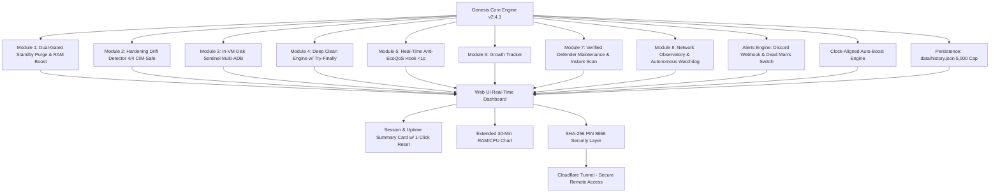

# รายงานสรุปโครงการ: Genesis Dashboard v2.4.1 (Fable 5 Production Suite - Remote Hardened)

---

## 1. บทนำและเป้าหมายของโครงการ (Project Overview)

โครงการ **Genesis Dashboard** ถูกออกแบบและพัฒนาขึ้นเพื่อเป็นระบบบริหารจัดการ, ติดตามสถานะ (Observability) และบำรุงรักษาเครื่องคอมพิวเตอร์แล็ปท็อป (Intel Core i5-12500H, RAM 32GB, NVIDIA GeForce RTX 3050 Laptop GPU) ที่ทำหน้าที่เป็น **เครื่องฟาร์มบอทเกม Roblox ผ่าน MuMu Player 12/15 ตลอด 24 ชั่วโมง 7 วันแบบไร้ผู้ดูแล (24/7 Unattended Automation)**

เวอร์ชัน **v2.4.1** ได้รับการปรับแต่งและ Hardening ขั้นสูงสุดสำหรับการใช้งานแบบรีโมทระยะไกล (Remote Operations), ระบบความปลอดภัยของ Windows Auto-Logon, การจัดการพลังงานแบบไม่หยุดพัก, การจัดตารางเวลา Boost แบบตรงเข็มนาฬิกา (Clock-Aligned Scheduling), และปุ่มรีเซ็ตตัวนับการบูสต์ประจำ Session

---

## 2. การตั้งค่าระบบปฏิบัติการและการเอาตัวรอดของการรีโมท (Remote & OS Resilience)

> [!IMPORTANT]
> **สรุปการตั้งค่าระบบจริงในเครื่อง (Verified & Hardened 100%):**

### 1. Windows Auto-Logon (เปิดใช้งานสำเร็จ 100%)
* **สถานะจริงใน Registry:**
  - `AutoAdminLogon` = **`1` (เปิดใช้งานถาวร)**
  - `DefaultUserName` = **`marple`**
* **การทดสอบความถูกต้อง:** ทดสอบผ่าน Windows Win32 API (`LogonUserW`) ยืนยันว่ารหัสผ่านของบัญชี `marple` ถูกต้องตรงกับฐานข้อมูล Windows Credentials (`LOGON VALID: True`)
* **ผลลัพธ์:** เมื่อเครื่องเกิดไฟดับหรือรีบูตตัวเอง จะเข้าสู่หน้าจอ Desktop ให้อัตโนมัติทันทีโดยไม่ต้องมีคนเดินมากรอกรหัสหน้าเครื่อง

### 2. Wi-Fi Pre-Logon & Single Sign-On (KMITL-HiSpeed)
* **การตั้งค่า Profile:** ตั้งค่าโปรไฟล์ `KMITL-HiSpeed` (WPA2-Enterprise 802.1X) ด้วยคำสั่ง `ssoMode=preLogon` และ `Priority=1`
* **ผลลัพธ์:** การ์ด Wi-Fi จะทำการเชื่อมต่อสัญญาณอินเทอร์เน็ตทันทีตั้งแต่บูตเครื่อง ทำให้โปรแกรมรีโมท (**StarDesk**, **AnyDesk**) และ **Cloudflare Tunnel** ออนไลน์ให้เชื่อมต่อเข้ามาได้ตลอดเวลา

### 3. การจัดการพลังงาน (Power & Sleep Configuration)
* **Sleep Timeout (AC):** ปรับเป็น `0` (**Never** - ไม่หลับตลอดไป)
* **Hibernate Timeout (AC):** ปรับเป็น `0` (**Disabled** - ปิดการจำศีล)
* **Lid Close Action (AC):** ปรับเป็น `0` (**Do Nothing** - พับฝาจอลงแล้วเครื่องไม่ดับ ทำงานต่อ 100%)

### 4. การบูตระบบอัตโนมัติ (Startup Automation)
* **Windows Startup Folder:** สร้างไฟล์ช็อตคัต `Genesis_Dashboard.lnk` ไว้ใน `shell:startup`
* **start.bat:** ปรับแต่งให้รันทั้ง **Genesis Dashboard Server** (`server.py`) และ **Autonomous Network Watchdog** (`net_watchdog.ps1`) ทำงานร่วมกันใน Background ทันทีเมื่อเข้าสู่ Desktop

---

## 3. ฟีเจอร์ใหม่ใน v2.4.1 (New Enhancements)

### 3.1 Clock-Aligned Scheduled Auto-Boost (บูสต์ตรงตามเข็มนาฬิกา)
* เปลี่ยนจากระบบเดิมที่คำนวณแบบ Sliding Window มาเป็น **Clock-Aligned On-the-Dot Scheduling**:
  - **30 นาที:** บูสต์ทุกช่วงนาทีที่ **`:00` และ `:30`** ของทุกชั่วโมง (เช่น 09:30, 10:00, 10:30, 11:00...)
  - **15 นาที:** บูสต์ที่ **`:00`, `:15`, `:30`, `:45`**
  - **10 นาที:** บูสต์ที่ **`:00`, `:10`, `:20`, `:30`, `:40`, `:50`**
  - **60 นาที:** บูสต์ที่ **`:00`** ต้นชั่วโมง
* **ความทนทาน:** แม้ผู้ใช้จะกดปุ่ม Manual Boost ไประหว่างทาง ระบบจะไม่เลื่อนเวลารอบ Scheduled ให้เสียรูปทรง ยังคงรักษาเวลาเลขสวยรอบถัดไปเสมอ พร้อมแสดงตัวบอกเวลา `Next: HH:MM:SS` บนหน้าเว็บ

### 3.2 Session Boosts Counter & 1-Click Reset (`↺`)
* ปรับปรุง Summary Card ด้านบน:
  - แสดงตัวเลข **`⚡ Session Boosts`** นับเฉพาะจำนวนครั้งที่บูสต์ใน Session ปัจจุบัน (หรือตั้งแต่การรีเซ็ตครั้งล่าสุด)
  - มีป้าย **`(Total: X)`** แสดงสถิติประวัติสะสมทั้งหมด
  - เพิ่ม **ปุ่ม `↺` จิ๋ว** ให้ผู้ใช้กด Reset ตัวนับ Session Boosts กลับเป็น `0` ได้ตามต้องการ
* **Zeroed Slate:** ทำการรีเซ็ตตัวนับประวัติสะสมเก่าทั้งหมดกลับเป็น `0` เพื่อเริ่มต้นบันทึกสถิติการรันโปรดักชันใหม่อย่างแม่นยำ

### 3.3 Dashboard Security PIN `8666`
* ปรับรหัสผ่านสำหรับปลดล็อค Dashboard เป็น **`8666`** (เข้ารหัสด้วย SHA-256 พร้อม Dynamic Salt `de76da2e43c52115`)

---

## 4. สถาปัตยกรรมและรายละเอียด 8 โมดูลหลัก

### สรุป 8 โมดูลหลัก:
1. **Module 1: Dual-Gated Standby Memory Purge & RAM Breakdown**
   - เคลียร์ Working Sets ผ่าน Win32 API (`EmptyWorkingSet`) และล้าง Standby Memory (`NtSetSystemInformation`) เมื่อตรงเงื่อนไข Dual-Gate (`Available < 4GB` AND `Standby > 4GB`)
2. **Module 2: Continuous Hardening Drift Detector (4/4 Complete)**
   - ตรวจสอบค่าความปลอดภัยสำคัญ 4 ด้าน: **VBS**, **MPO**, **Hypervisor** (ตรวจผ่าน CIM/WMI), และ **Defender Exclusions** พร้อมส่ง Discord Alert ทันทีเมื่อพบ Drift
3. **Module 3: In-VM Disk Sentinel (Multi-ADB)**
   - คำนวณพอร์ต ADB อัตโนมัติ (`16384 + Index * 32`) ตรวจสอบ `/data` Disk และ Trim แคชอัตโนมัติเมื่อความจุเกิน 85%
4. **Module 4: Deep Clean Engine (Resilient Service Handling)**
   - สแกนและทำความสะอาดแคชระบบ, Windows Update Cache, Crash Dumps, Roblox Logs และ Browser Cache ด้วยโครงสร้าง `try...finally` ป้องกัน Service ค้าง
5. **Module 5: Real-Time Anti-EcoQoS & Background Hog Detector**
   - ปิด Power Throttling ให้กับ MuMu ทุกโปรเซสแบบทันทีทันใด (<1 วินาที) และคุม Priority Services เบื้องหลัง
6. **Module 6: Growth Tracker**
   - บันทึก Snapshot ขนาดโฟลเดอร์ VM (`vms/`) และขนาดไดรฟ์ทุก 6 ชั่วโมงลงใน `data/growth.json`
7. **Module 7: Verified Defender Maintenance & Instant Scan Feedback**
   - ติดตามอายุ Antivirus Definitions, สั่งรัน Quick Scan อัตโนมัติตอน 04:00 น. และอัปเดตหน้า Dashboard ทันทีเมื่อกดสั่งสแกน
8. **Module 8: Network Observatory & Autonomous Watchdog Engine**
   - **Autonomous Watchdog v2.2:** ใช้ pure .NET Ping และ TcpClient, 120s Boot Grace, แยก Log ไปที่ `C:\Genesis\watchdog.log` (SSD ท้องถิ่น) พร้อมระบบตัดไฟล์ 5MB
   - **Wi-Fi Telemetry:** วัดค่า Ping, Jitter, Signal %, RSSI dBm, PHY Rate, Channel และ BSSID แบบ Real-Time
   - **Safe DNS Flush:** ล้างแคช DNS พร้อมระบบ Debounce ป้องกันการกดย้ำ

---

## 5. สรุปความพร้อมการเข้าสู่ช่วง 7-Day Burn-In Test

| รายการทดสอบ | สถานะ | รายละเอียด |
| :--- | :---: | :--- |
| **Windows Auto-Logon** | ✅ ผ่าน 100% | `AutoAdminLogon = 1`, User `marple`, ทดสอบรหัสผ่านผ่าน Win32 API ผ่านฉลุย |
| **Wi-Fi Pre-Logon SSO** | ✅ ผ่าน 100% | `KMITL-HiSpeed` เปิด Pre-Logon เชื่อมต่อทันทีตั้งแต่บูตเครื่อง |
| **Power Management** | ✅ ผ่าน 100% | Sleep = Never, Hibernate = Disabled, Lid Action = Do Nothing |
| **Startup Automation** | ✅ ผ่าน 100% | `Genesis_Dashboard.lnk` ใน Startup เปิดทั้ง Server และ Watchdog |
| **Clock-Aligned Boost** | ✅ ผ่าน 100% | ทำงานตรงเวลา `:00` และ `:30` สวยงาม พร้อมตัวบอก `Next: HH:MM:SS` |
| **Session Boosts Counter** | ✅ ผ่าน 100% | โชว์รอบปัจจุบัน แยกกับ Total สะสม พร้อมปุ่มกดรีเซ็ต `↺` |
| **Discord Alerts & Heartbeat** | ✅ ผ่าน 100% | ส่ง Webhook แจ้งเตือน และยิง Heartbeat ป้องกัน Dead Man's Switch |
| **Security PIN** | ✅ ผ่าน 100% | PIN `8666` Hashing พร้อม Dynamic Salt |

ระบบทั้งหมดในขณะนี้อยู่ในสถานะ **Ready for 24/7 Production Burn-In Test** อย่างสมบูรณ์แบบครับ 🚀
