# 📋 รายงานสถาปัตยกรรมและการพัฒนาระบบ Genesis Framework (System Architecture & Development Report)

เอกสารสรุปความคืบหน้าการออกแบบสถาปัตยกรรมซอฟต์แวร์, การพัฒนาระบบอัตโนมัติ (Workflow Automation), การวิเคราะห์โครงสร้างข้อมูล (Schema Discovery), และแผนการพัฒนาส่วนติดต่อผู้ใช้ (UI Framework) สำหรับแพลตฟอร์ม Roblox

---

## 📌 1. ความคืบหน้าและการพัฒนาที่เสร็จสิ้น (Completed Milestones)

### 🔹 1.1 Multi-App Dynamic Loader Architecture
* พัฒนาระบบ Core Loader ([loader.lua](file:///c:/Users/rocke/OneDrive/Documents/GitHub/Genesis/Roblox/loader.lua)) เพื่อรองรับการระบุและโหลดโมดูลแอปพลิเคชันแบบไดนามิกตามสภาพแวดล้อม (`PlaceId`, `GameId`, และ `CreatorId`)
* จัดโครงสร้างไดเรกทอรีให้อยู่ในโฟลเดอร์ [Roblox/](file:///c:/Users/rocke/OneDrive/Documents/GitHub/Genesis/Roblox) เพื่อความคลีนและแยกความเป็นสัดส่วนของโค้ดเบส

### 🔹 1.2 Hang Detection & Auto-Recovery Watchdog System
* พัฒนาระบบเฝ้าระวังสถานะการทำงาน (Watchdog Service) โดยใช้การติดตามพิกัดการเคลื่อนที่ของตัวละคร (`HumanoidRootPart Telemetry`)
* หากตรวจพบสภาวะการทำงานค้างหรือไม่มีการเคลื่อนไหวเกินระยะเวลาที่กำหนด (Idle Threshold เช่น 15 วินาที) ระบบจะสั่งรีเซ็ตสถานะและทำการ Re-spawn ตัวละครอัตโนมัติ เพื่อให้กระบวนการทำงานสามารถดำเนินต่อไปได้อย่างต่อเนื่อง

### 🔹 1.3 Network Interface & Schema Discovery (`Genesis_EventsDump.json`)
* ดำเนินการตรวจสอบและทำดัชนีรายการ Remote Interfaces ทั้งหมดของเกม ขนาด **86 KB (มากกว่า 300+ Endpoints)**
* จัดหมวดหมู่โครงสร้าง API ฝั่ง Client-Server สำหรับระบบประมูล (Auction), ระบบจัดการไอเทม (Item Processing), ระบบร้านค้า (Shop), ระบบสะเดาะกล่อง (Locksmith), และระบบรางวัล (Rewards)

### 🔹 1.4 ปรับปรุงประสิทธิภาพของระบบ Task Processing
* **Item Washing & Cleaning Pipeline:** ปรับปรุงตรรกะการประมวลผลไอเทมให้ทำงานแบบ Direct Method Call (`StartWash` และ `ClaimWashedItem`) เพื่อแก้ไขปัญหาการติดสถานะรอลูปเดิม พร้อมติดตั้งระบบ **Rarity Matrix Filter (8 ระดับ)** สำหรับคัดกรองไอเทมตามมูลค่า
* **High-Throughput Item Ingestion (Fast Pickup):** ปรับปรุงประสิทธิภาพการรับไอเทมหลังสิ้นสุดรอบกิจกรรม ให้ทำงานแบบไร้ดีเลย์อนิเมชันเพื่อลด Latency ในการรับข้อมูล

### 🔹 1.5 Telemetry & Network Profiling
* พัฒนาระบบบันทึกและวิเคราะห์การเรียกใช้งาน Network Endpoints (`Genesis Telemetry Profiler`) เพื่อตรวจสอบพารามิเตอร์ (Arguments) และลำดับขั้นตอนการทำงานของระบบได้อย่างถูกต้องแม่นยำ

### 🔹 1.6 Modular Architecture Refactoring
* แยกโมดูลฟังก์ชันการทำงานออกเป็น Service ย่อยใน [Roblox/games/storage_hunter/functions/](file:///c:/Users/rocke/OneDrive/Documents/GitHub/Genesis/Roblox/games/storage_hunter/functions) เพื่อรองรับการบำรุงรักษาและการขยายระบบในอนาคต (Scalability & Maintainability)

---

## 🔍 2. การวิเคราะห์ข้อมูลและแบบจำลอง UI (UI & System Modeling)

* **UI Design Pattern:** วิเคราะห์แบบจำลองส่วนติดต่อผู้ใช้จากภาพอ้างอิง 55 ภาพ โดยเลือกใช้โครงสร้าง **Obsidian 2-Column Sidebar Layout**
* **โครงสร้างคอมโพเนนต์:**
  * แถบ Sidebar ด้านซ้ายพร้อมไอคอนแยกหมวดหมู่
  * แผงควบคุมเนื้อหาแบบการ์ด 2 คอลัมน์ (2-Column Responsive Card Grid)
  * คอมโพเนนต์มาตรฐาน: Pill Toggles, Sliders พร้อมตัวเลขแสดงผลแบบเรียลไทม์, Single/Multi-Select Dropdowns, TextBoxes, และ Accordion Panels
  * แผง **Live Telemetry Dashboard** แสดงเวลานับถอยหลังของกิจกรรมในเกมแบบเรียลไทม์

---

## 🚀 3. แผนงานสถาปัตยกรรมระบบขั้นถัดไป (Next Engineering Milestones)

```mermaid
graph TD
    A[Genesis Hub UI Engine] --> B[Auction Automation Service]
    A --> C[Item Processing Service]
    A --> D[Store & Inventory Management]
    A --> E[Rewards & Events Service]
    A --> F[Utilities & Watchdog Engine]
    
    B --> B1[Auto Bid & Target Area Routing]
    B --> B2[High-Speed Ingestion Pipeline]
    B --> B3[Analytical Tools & NPC Management]
    
    C --> C1[Auto Wash with Rarity Matrix]
    C --> C2[Item Repair & Maintenance]
    C --> C3[Grading & Authentication Pipeline]
    C --> C4[Locksmith & Vault Automation]
    
    D --> D1[Inventory Stocking & Auto-Reprice]
    D --> D2[Automated Item Liquidation]
    D --> D3[Transport Logistics & Unload]
    
    E --> E1[Museum Yield Collection]
    E --> E2[Achievement & Daily Task Engine]
    E --> E3[Lost Inventory Retrieval]
    
    F --> F1[Position Tracking & Auto-Recovery]
    F --> F2[Custom Movement & Physics Controller]
    F --> F3[Automated Consumable Management]
```

### รายละเอียดการพัฒนา:
1. **สร้าง UI Engine สไตล์ Obsidian แบบสมบูรณ์:**
   * พัฒนาระบบ Navigation Sidebar, Top Header Bar, และ 2-Column Responsive Grid
   * สร้าง Library คอมโพเนนต์ที่รองรับการจัดการ Event และ State Binding
2. **เชื่อมต่อและพัฒนาระบบทั้ง 10 โมดูลหลัก:**
   * `auction.lua`, `wash.lua`, `repair.lua`, `grading.lua`, `locksmith.lua`, `authenticate.lua`, `stock.lua`, `rewards.lua`, `utils.lua`, `reset.lua`
3. **ระบบ Persistent Storage (`settings.json`):** เข้ารหัส/ถอดรหัส JSON เพื่อบันทึกค่าคอนฟิกูเรชันทั้งหมดในสภาพแวดล้อม Client
4. **มาตรฐานการเขียนโค้ด:** ปราศจาก Comment ทั้งหมด (Zero-comment policy)
5. **การส่งมอบงาน:** ทำการ Commit และ Push ขึ้น GitHub Repository ([vxmpie/Genesis](https://github.com/vxmpie/Genesis)) อัตโนมัติหลังการทดสอบเสร็จสิ้น
